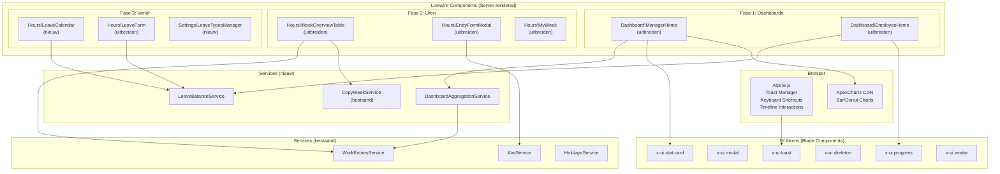
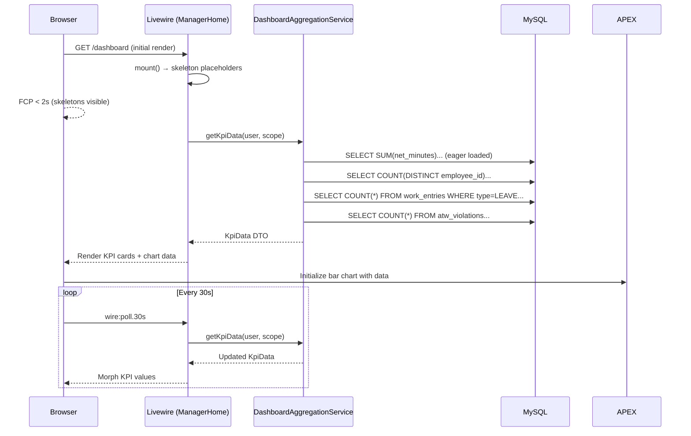
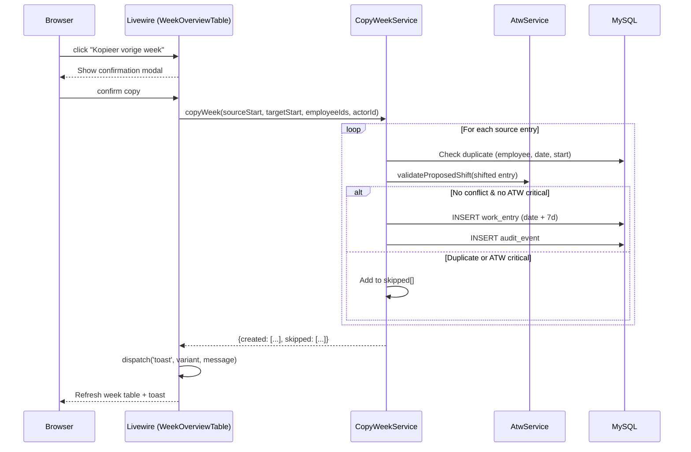
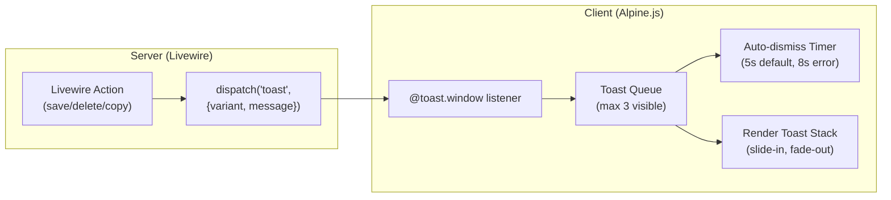
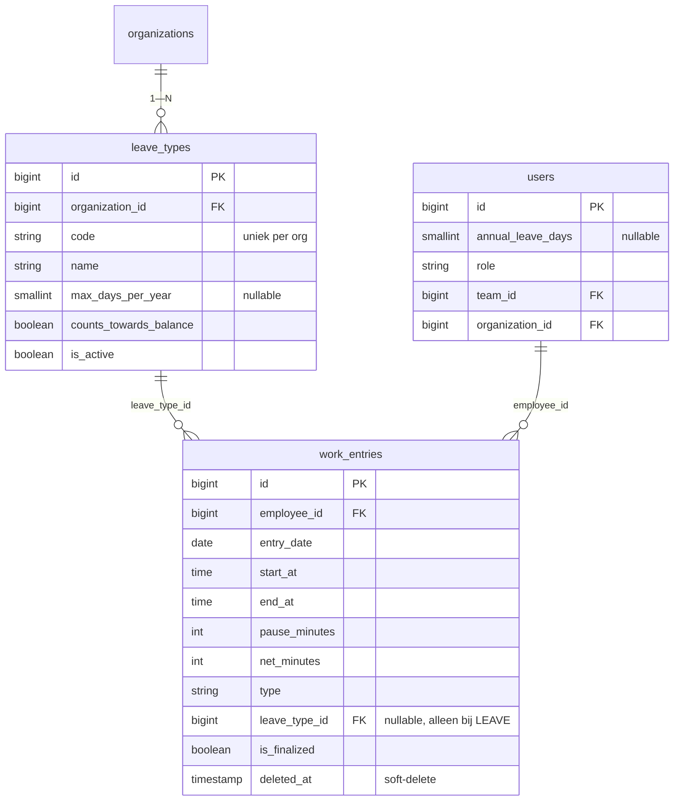

# Design Document — La Vita Urenregistratie (Frontend Features)

## Overview

Dit ontwerp beschrijft de frontend-uitbreiding van de La Vita Urenregistratie applicatie, gericht op drie fasen: (1) Dashboard Revolutie met KPI-cards en grafieken, (2) Uren-invoer Verbeteren met kleurcodering, copy-week en slimme defaults, en (3) Verlof-systeem Uitbreiden met kalender, saldo-tracking en verlof-types.

De applicatie draait op **Laravel 13 + Livewire 3.6 + Tailwind CSS + Alpine.js + MySQL**, gehost op Cloud86 shared hosting (cPanel, FTP, geen SSH). De backend is grotendeels compleet; dit ontwerp focust op de Livewire-componenten, UI-atoms, data-aggregatie en client-side interactie die nodig zijn om de requirements te realiseren.

**Kernbeslissingen:**
- **ApexCharts via CDN** voor grafieken (geen npm build-stap nodig op shared hosting)
- **Alpine.js** voor client-side toast-management, keyboard shortcuts en timeline-interactie
- **Livewire `lazy`** voor zware widgets (charts, kalender) om FCP < 2s te halen
- **Livewire `wire:poll.30s`** voor near-realtime KPI-updates zonder WebSockets
- **Bestaande services hergebruiken** (WorkEntriesService, AtwService) — geen HTTP-roundtrips naar eigen API vanuit Livewire

## Architecture

### Hoog-niveau componentenarchitectuur



### Request-flow: Dashboard KPI-laden



### Request-flow: Copy-week



### Toast-systeem architectuur



## Components and Interfaces

### Nieuwe/uitgebreide Livewire-componenten

| Component | Route | Fase | Actie |
|---|---|---|---|
| `Dashboard\ManagerHome` | `/dashboard` | 1 | Uitbreiden met KPI-cards, ApexCharts, activiteit-feed, wire:poll |
| `Dashboard\EmployeeHome` | `/dashboard` (employee) | 1 | Uitbreiden met progress bars, verlof-saldo, mini-weekoverzicht |
| `Hours\WeekOverviewTable` | `/uren/week` | 2 | Uitbreiden met kleurcodering, totalen, copy-week, print, ATW-indicators |
| `Hours\EntryFormModal` | (modal) | 2 | Uitbreiden met slimme defaults, keyboard shortcuts |
| `Hours\MyWeek` | `/uren/mijn-week` | 2 | Uitbreiden met visuele tijdlijn |
| `Hours\LeaveCalendar` (nieuw) | `/verlof/kalender` | 3 | Maandweergave verlof/ziekte/feestdagen |
| `Hours\LeaveForm` | `/verlof` | 3 | Uitbreiden met half-dag, annuleren, verlof-types |
| `Settings\LeaveTypesManager` (nieuw) | `/instellingen/verlof-types` | 3 | CRUD verlof-types |

### Nieuwe UI-atoms (Blade Components)

#### `<x-ui.toast>`

```php
@props([
    'variant' => 'info',    // success | error | warning | info
    'message' => '',        // string
    'duration' => 5000,     // ms (8000 voor error)
])
```

**Implementatie:** Alpine.js component met `x-data="toastManager()"` op een globale container in `layouts/app.blade.php`. Luistert naar `@toast.window` events. Beheert een queue van max 3 zichtbare toasts. Elke toast heeft een countdown-timer die pauzeert bij hover.

**Styling:** Positioned `fixed top-4 right-4` (desktop) of `fixed top-4 inset-x-4` (mobiel). Slide-in van rechts via `translate-x-full → translate-x-0` transition (300ms). Fade-out via `opacity-0` (200ms).

**ARIA:** `role="alert"`, `aria-live="polite"`, sluit-knop met `aria-label="Melding sluiten"`.

#### `<x-ui.modal>`

```php
@props([
    'title' => '',          // string
    'size' => 'md',         // sm | md | lg
    'show' => false,        // bool (Alpine.js controlled)
])
```

**Implementatie:** Alpine.js `x-show` met `x-transition` (scale 95%→100% + opacity). Focus-trap via `@focusin` handler. Escape-toets sluit modal. Backdrop click sluit modal.

**ARIA:** `role="dialog"`, `aria-modal="true"`, `aria-labelledby` verwijst naar title-element.

**Sizes:** `sm` = max-w-sm (384px), `md` = max-w-lg (512px), `lg` = max-w-2xl (672px).

#### `<x-ui.progress>`

```php
@props([
    'value' => 0,           // 0-100 (of absolute waarde)
    'max' => 100,           // maximum
    'variant' => 'success', // success | warning | danger
    'label' => '',          // string
    'showPercentage' => true, // bool
])
```

**Berekening:** `width% = min(100, max(0, (value / max) * 100))`. Variant bepaalt de balk-kleur: success = `bg-brand-green`, warning = `bg-warning`, danger = `bg-danger`.

**ARIA:** `role="progressbar"`, `aria-valuenow={value}`, `aria-valuemin="0"`, `aria-valuemax={max}`.

#### `<x-ui.skeleton>`

```php
@props([
    'type' => 'text',       // text | card | chart | avatar
    'lines' => 3,           // integer (voor type=text)
])
```

**Implementatie:** Pulserende placeholder (`animate-pulse bg-surface rounded`). Types:
- `text`: N regels van variërende breedte (100%, 80%, 60%)
- `card`: Rechthoek 100% × 120px met rounded-card
- `chart`: Rechthoek 100% × 200px
- `avatar`: Cirkel 40px (sm), 48px (md), 56px (lg)

#### `<x-ui.stat-card>`

```php
@props([
    'title' => '',          // string (KPI-label)
    'value' => '',          // string|number (hoofdwaarde)
    'trend' => 'neutral',   // up | down | neutral
    'trendValue' => '',     // string (bijv. "+12%")
    'icon' => null,         // optioneel SVG-icoon
])
```

**Implementatie:** Wraps `<x-ui.card>` met een gekleurde accent-rand links: `border-l-4`. Trend up = `border-brand-green` + groene pijl, trend down = `border-danger` + rode pijl, neutral = `border-hairline`.

#### `<x-ui.avatar>`

```php
@props([
    'name' => '',           // string (voor initialen)
    'size' => 'md',         // sm (32px) | md (40px) | lg (48px)
    'src' => null,          // optioneel foto-URL
])
```

**Initialen-algoritme:** Neem eerste letter van eerste woord + eerste letter van laatste woord. Fallback naar eerste 2 letters als er maar 1 woord is. Achtergrondkleur deterministisch op basis van naam-hash (6 voorgedefinieerde kleuren).

### Nieuwe Services

#### `DashboardAggregationService`

Verantwoordelijk voor het berekenen van alle KPI-data voor het manager/owner dashboard in één efficiënte query-batch.

```php
class DashboardAggregationService
{
    /**
     * @return array{
     *   total_hours_this_week: int,        // netto-minuten
     *   total_hours_prev_week: int,        // voor trend-berekening
     *   attendance_percentage: int,         // 0-100
     *   pending_leave_count: int,
     *   atw_critical_count: int,
     *   atw_warning_count: int,
     *   open_objections_count: int,
     *   sick_percentage: float,
     *   chart_data: array<string, int>,    // [dag => minuten]
     *   activity_feed: array,              // laatste 10 events
     * }
     */
    public function getKpiData(User $user, ?int $teamFilter = null): array;
}
```

#### `LeaveBalanceService`

Berekent verlof-saldo met ondersteuning voor half-dag verlof en verlof-types.

```php
class LeaveBalanceService
{
    /**
     * @return array{
     *   annual_days: int|null,
     *   taken_days: float,          // 0.5 per half-dag
     *   remaining_days: float|null,
     *   status: 'ok'|'warning'|'danger'|'unconfigured',
     *   breakdown: array<string, float>,  // per leave_type
     * }
     */
    public function getBalance(int $userId, int $year): array;

    /**
     * Tel alleen entries met:
     * - type = LEAVE
     * - is_finalized = true (of PENDING voor reservering)
     * - deleted_at IS NULL
     * - leave_type.counts_towards_balance = true
     * - entry_date in het opgegeven jaar
     * Half-dag (start=00:00,end=12:30 of start=12:30,end=23:59) telt als 0.5
     */
    public function calculateTakenDays(int $userId, int $year): float;
}
```

### Design Tokens (bestaand, hergebruiken)

Alle UI gebruikt uitsluitend de tokens uit `tailwind.config.js`:

| Token | Waarde | Gebruik in deze feature |
|---|---|---|
| `brand-green` | `#00d4a4` | Positive trend accent, WORK-kleurcodering, progress success |
| `danger` | `#ef4444` | SICK-kleurcodering, error toast, negative trend |
| `warning` | `#f59e0b` | ATW-waarschuwingen, warning toast |
| `surface` | `#f7f7f7` | Totaal-rij achtergrond, skeleton pulse |
| `hairline` | `#e5e5e5` | Lege cel border, card borders |
| `ink` | `#0a0a0a` | Body tekst |
| `steel` | `#5a5a5c` | Secundaire tekst, "Geen registratie" |
| `canvas` | `#FFFFFF` | Pagina-achtergrond, lege cellen |

**Kleurcodering werkregel-types (Color_Coding):**

| Type | Achtergrond | Border-left | Tijdlijn-balk |
|---|---|---|---|
| WORK | `bg-emerald-50` | `border-brand-green` | `bg-brand-green` |
| SICK | `bg-red-50` | `border-danger` | `bg-danger` |
| LEAVE | `bg-blue-50` | `border-blue-500` | `bg-blue-500` |
| HOLIDAY | `bg-purple-50` | `border-purple-500` | `bg-purple-500` |
| Leeg | `bg-canvas` | `border-dashed border-hairline` | — |

### Livewire Events (inter-component communicatie)

| Event | Dispatcher | Listener | Payload |
|---|---|---|---|
| `toast` | Alle componenten | Alpine.js toastManager | `{variant, message, duration?}` |
| `entry-saved` | EntryFormModal | WeekOverviewTable, MyWeek | `{employeeId, entryDate}` |
| `open-entry-form-modal` | WeekOverviewTable | EntryFormModal | `{employeeId, entryDate}` |
| `copy-week-completed` | WeekOverviewTable | WeekOverviewTable (self) | `{created, skipped}` |
| `leave-cancelled` | LeaveForm | EmployeeHome, LeaveCalendar | `{entryId}` |
| `leave-type-updated` | LeaveTypesManager | LeaveForm, LeaveCalendar | `{}` |

### Keyboard Shortcuts (Alpine.js)

| Shortcut | Context | Actie |
|---|---|---|
| `Enter` | EntryFormModal open + velden gevuld | Submit formulier |
| `Escape` | EntryFormModal open | Sluit modal |
| `Escape` | Bevestigingsmodal open | Sluit modal |
| `←` / `→` | WeekOverviewTable, MyWeek, LeaveCalendar | Vorige/volgende week/maand |

## Data Models

### Nieuwe tabel: `leave_types`

```sql
CREATE TABLE leave_types (
    id BIGINT UNSIGNED PRIMARY KEY AUTO_INCREMENT,
    organization_id BIGINT UNSIGNED NOT NULL,
    code VARCHAR(40) NOT NULL,
    name VARCHAR(120) NOT NULL,
    description VARCHAR(500) NULL,
    max_days_per_year SMALLINT UNSIGNED NULL,
    counts_towards_balance BOOLEAN NOT NULL DEFAULT TRUE,
    is_active BOOLEAN NOT NULL DEFAULT TRUE,
    created_at TIMESTAMP NULL,
    updated_at TIMESTAMP NULL,
    UNIQUE KEY uq_leave_types_org_code (organization_id, code),
    INDEX idx_leave_types_org_active (organization_id, is_active),
    CONSTRAINT fk_leave_types_org FOREIGN KEY (organization_id)
        REFERENCES organizations(id) ON DELETE CASCADE
);
```

### Kolom-toevoegingen: `users`

```sql
ALTER TABLE users
    ADD COLUMN annual_leave_days SMALLINT UNSIGNED NULL
        COMMENT 'Jaarlijks verlofrecht in dagen' AFTER team_id;
```

### Kolom-toevoegingen: `work_entries`

```sql
ALTER TABLE work_entries
    ADD COLUMN leave_type_id BIGINT UNSIGNED NULL AFTER type,
    ADD INDEX idx_we_leave_type (leave_type_id),
    ADD CONSTRAINT fk_we_leave_type FOREIGN KEY (leave_type_id)
        REFERENCES leave_types(id) ON DELETE SET NULL;
```

### Seed-data: standaard verlof-types

Bij organisatie-aanmaak worden 4 standaard verlof-types geseeded:

| Code | Naam | counts_towards_balance | max_days_per_year |
|---|---|---|---|
| `VAKANTIE` | Vakantieverlof | true | null |
| `BIJZONDER` | Bijzonder verlof | false | null |
| `ONBETAALD` | Onbetaald verlof | false | null |
| `OUDERSCHAP` | Ouderschapsverlof | false | null |

### E-mail templates (uitbreiding)

Nieuwe templates in `email_templates`:

| Type | Trigger | Placeholders |
|---|---|---|
| `leave_approved` | Verlof goedgekeurd | `full_name, leave_date, leave_type, approved_by` |
| `leave_rejected` | Verlof afgewezen | `full_name, leave_date, leave_type, rejected_by, reason` |
| `leave_requested` | Nieuwe verlofaanvraag | `employee_name, leave_date, leave_type, note` |
| `leave_reminder` | 3 werkdagen onbehandeld | `manager_name, employee_name, leave_date` |

### Audit-events (nieuwe types)

| Event type | Trigger |
|---|---|
| `LEAVE_ALLOWANCE_UPDATED` | Owner wijzigt annual_leave_days |
| `LEAVE_CANCELLED` | Medewerker annuleert pending verlof |
| `LEAVE_TYPE_CREATED` | Owner maakt verlof-type aan |
| `LEAVE_TYPE_UPDATED` | Owner wijzigt verlof-type |
| `LEAVE_TYPE_DEACTIVATED` | Owner deactiveert verlof-type |
| `WEEK_COPIED` | Manager/owner kopieert week |

### ER-diagram uitbreiding



## Correctness Properties

*Een property is een eigenschap of gedrag dat universeel waar moet zijn over alle geldige uitvoeringen van het systeem — een formele uitspraak over wat het systeem moet doen. Properties vormen de brug tussen leesbare specificaties en machine-verifieerbare correctheidsgaranties.*

### Property 1: Netto-minuten berekening is correct

*Voor elke* `(start_time, end_time, pause_minutes)` met `end_time > start_time` en `pause_minutes ∈ [0, 480]`, geldt dat de berekende `net_minutes == max(0, (end_time - start_time)_in_minutes - pause_minutes)`.

**Validates: Requirements 6.3**

### Property 2: Weekoverzicht totalen zijn consistent met individuele cellen

*Voor elke* set werkregels in een week, geldt: (a) de totaal-kolom per medewerker is gelijk aan de som van `net_minutes` van alle werkregels van die medewerker in die week, (b) de totaal-rij per dag is gelijk aan de som van `net_minutes` van alle medewerkers op die dag, en (c) de Grand_Total is gelijk aan de som van alle totaal-kolommen (of equivalente som van alle totaal-rijen).

**Validates: Requirements 4.3, 4.4, 4.5**

### Property 3: Kleurcodering is deterministisch per type

*Voor elke* werkregel met een `type ∈ {WORK, SICK, LEAVE, HOLIDAY}`, geldt dat de toegekende CSS-klassen (achtergrond + border) uitsluitend afhangen van het `type`-veld en niet van `is_finalized`, `employee_id`, `entry_date` of andere attributen. De mapping is: WORK → `(bg-emerald-50, border-brand-green)`, SICK → `(bg-red-50, border-danger)`, LEAVE → `(bg-blue-50, border-blue-500)`, HOLIDAY → `(bg-purple-50, border-purple-500)`.

**Validates: Requirements 4.1, 4.10, 7.2, 8.2**

### Property 4: Data-scoping per rol is waterdicht

*Voor elke* manager-gebruiker met `team_id = T`, geldt dat alle data geretourneerd door dashboard-KPI's, weekoverzicht en verlofkalender uitsluitend werkregels, gebruikers en violations bevat waarvoor `user.team_id = T`. *Voor elke* owner-gebruiker geldt dat alle data beperkt is tot `user.organization_id = O` (de eigen organisatie).

**Validates: Requirements 1.8, 8.3**

### Property 5: Verlof-saldo berekening is correct

*Voor elke* medewerker met `annual_leave_days = A` (niet null) en een willekeurige set verlof-werkregels in het huidige jaar, geldt: `remaining = A - taken`, waarbij `taken` de som is van: 1.0 voor elke hele-dag verlof-entry (type=LEAVE, is_finalized=true, deleted_at=null, leave_type.counts_towards_balance=true) en 0.5 voor elke halve-dag verlof-entry (herkenbaar aan start=00:00/end=12:30 of start=12:30/end=23:59).

**Validates: Requirements 9.3, 9.4, 10.4, 10.9, 11.6**

### Property 6: Copy-week verschuift entries exact 7 dagen

*Voor elke* bronweek met werkregels van type WORK (zonder ATW-critical-signalen op de doelweek en zonder bestaande conflicten), geldt na copy-week: het aantal aangemaakte entries is gelijk aan het aantal bronentries, en voor elke gekopieerde entry `c` bestaat een bronentry `b` met `c.entry_date = b.entry_date + 7 dagen`, `c.start_at = b.start_at`, `c.end_at = b.end_at`, en `c.net_minutes = b.net_minutes`.

**Validates: Requirements 5.3**

### Property 7: Copy-week created + skipped = bron-totaal

*Voor elke* copy-week-aanroep geldt: `|created| + |skipped| = |bron_entries|`. Elke entry in `skipped` heeft een `reason ∈ {DUPLICATE, ATW_BLOCKED}`. Een entry is DUPLICATE als er al een entry bestaat op `(employee_id, target_date, start_time)`. Een entry is ATW_BLOCKED als de gekopieerde versie een ATW-critical-signal zou veroorzaken.

**Validates: Requirements 5.4, 5.5, 5.6**

### Property 8: Toast-variant bepaalt correcte styling en timing

*Voor elke* toast met `variant ∈ {success, error, warning, info}`, geldt: (a) de CSS-klassen bevatten de juiste kleur (success=groen, error=rood, warning=oranje, info=blauw), (b) de auto-dismiss-duur is 5000ms voor success/warning/info en 8000ms voor error, (c) `role="alert"` en `aria-live="polite"` zijn aanwezig.

**Validates: Requirements 3.1, 3.5, 3.9, 3.10**

### Property 9: Toast-queue toont maximaal 3 tegelijk

*Voor elk* aantal N ≥ 1 gelijktijdig gedispatchte toasts, geldt dat het aantal zichtbare toasts in de DOM op elk moment ≤ 3 is. Nieuwe toasts worden in de queue geplaatst en verschijnen zodra een zichtbare toast verdwijnt.

**Validates: Requirements 3.6**

### Property 10: Progress-bar breedte is proportioneel aan value/max

*Voor elke* `(value, max)` met `max > 0`, geldt dat de breedte van de progress-balk gelijk is aan `min(100, max(0, value / max * 100))` procent. De variant (success/warning/danger) bepaalt uitsluitend de kleur, niet de breedte.

**Validates: Requirements 12.3**

### Property 11: Avatar-initialen worden correct afgeleid

*Voor elke* naam-string met minstens 1 karakter, geldt: als de naam 2+ woorden bevat, zijn de initialen de eerste letter van het eerste woord + eerste letter van het laatste woord (hoofdletters). Als de naam 1 woord bevat, zijn de initialen de eerste 2 letters (of 1 letter als de naam 1 karakter is).

**Validates: Requirements 12.6**

### Property 12: Slimme defaults tonen vorige werkdag-tijden

*Voor elke* medewerker die op de vorige werkdag (ma-vr, exclusief feestdagen) een werkregel van type WORK had met `start_at` en `end_at`, geldt dat bij het openen van de invoer-modal de placeholder-tekst "Vorige dag: [start] - [end]" wordt getoond met de exacte tijden van die vorige werkregel.

**Validates: Requirements 6.2**

### Property 13: Verlof-types dropdown toont alleen actieve types van eigen organisatie

*Voor elke* medewerker in organisatie O, geldt dat de verlof-type-dropdown bij verlof-aanvraag uitsluitend leave_types bevat waarvoor `organization_id = O` en `is_active = true`. Gedeactiveerde types verschijnen niet, types van andere organisaties verschijnen niet.

**Validates: Requirements 11.5, 11.9**

### Property 14: Goedgekeurd verlof kan niet geannuleerd worden

*Voor elke* verlof-werkregel met `is_finalized = true`, geldt dat een annuleringspoging wordt geweigerd (HTTP 409 met code `LEAVE_ALREADY_APPROVED`). De werkregel blijft ongewijzigd in de database.

**Validates: Requirements 10.8**

### Property 15: Verlof-herinnering respecteert opt-out en threshold

*Voor elke* verlofaanvraag die langer dan 3 werkdagen onbehandeld is, geldt: als de medewerker `email_reminders_opt_in = true` heeft, wordt een `leave_reminder` mail gequeued voor de manager(s). Als `email_reminders_opt_in = false`, wordt geen herinnering verstuurd. Essentiële mails (goedkeuring/afwijzing) worden altijd verstuurd ongeacht opt-in status.

**Validates: Requirements 13.5, 13.7**

### Property 16: KPI-aggregatie is consistent met onderliggende data

*Voor elke* set werkregels in de huidige week binnen een scope (team of organisatie), geldt: (a) `total_hours_this_week` = SUM(net_minutes) van alle entries met deleted_at=null, (b) `attendance_percentage` = (distinct employee_ids met ≥1 entry) / (totaal actieve employees in scope) × 100, (c) `pending_leave_count` = COUNT(entries met type=LEAVE en is_finalized=false en deleted_at=null), (d) trend = total_hours_this_week - total_hours_prev_week (positief = up, negatief = down).

**Validates: Requirements 1.2, 1.3**

### Property 17: Tijdlijn-positie is proportioneel aan tijdstip

*Voor elke* werkregel met `start_at` en `end_at` binnen het bereik 06:00-22:00, geldt dat de horizontale positie van de tijdlijnbalk berekend wordt als: `left% = (start_minutes - 360) / (1320 - 360) × 100` en `width% = (end_minutes - start_minutes) / (1320 - 360) × 100`, waarbij 360 = 06:00 in minuten en 1320 = 22:00 in minuten.

**Validates: Requirements 7.1**

## Error Handling

| Foutscenario | Strategie | Gebruikersfeedback |
|---|---|---|
| Copy-week: bronweek leeg | Geen DB-writes, early return | Toast (info): "Vorige week bevat geen werkregels om te kopiëren" |
| Copy-week: duplicaat in doelweek | Skip entry, add to `skipped[]` | Toast (warning) met aantal overgeslagen + detail |
| Copy-week: ATW-critical op doelweek | Skip entry, add to `skipped[]` | Toast (warning) met reden per entry |
| Invoer-modal: ATW-critical | Blokkeer opslaan-knop | Rode banner boven knop met NL-melding |
| Invoer-modal: ATW-warning | Sta opslaan toe | Oranje banner boven knop met NL-melding |
| Invoer-modal: validatiefout | Houd modal open | Inline foutmelding bij betreffend veld (NL) |
| Verlof annuleren: reeds goedgekeurd | HTTP 409 | Toast (error): "Dit verlof is al goedgekeurd en kan niet meer geannuleerd worden" |
| Verlof-saldo: niet geconfigureerd | Widget verbergen | Geen foutmelding, widget simpelweg afwezig |
| Verlof-type max bereikt | Soft limit, toon waarschuwing | Oranje banner: "Maximum [type] bereikt ([X] dagen per jaar)" |
| Dashboard: geen data beschikbaar | Toon lege staat | "Geen gegevens beschikbaar voor deze periode" in steel-kleur |
| Weekoverzicht: >15 medewerkers | Horizontaal scrollbaar | Sticky eerste kolom (namen) |
| Verlofkalender: >20 medewerkers | Verticaal scrollbaar | Sticky header-rij (dagen) |
| Print: geen werkregels | Toon lege tabel | Print-weergave met lege cellen |
| Livewire poll: netwerk-timeout | Stille retry bij volgende poll-interval | Geen foutmelding (graceful degradation) |

### Foutcodes (nieuw voor deze feature)

| Code | HTTP | Context |
|---|---|---|
| `LEAVE_ALREADY_APPROVED` | 409 | Annulering van goedgekeurd verlof |
| `LEAVE_TYPE_NOT_FOUND` | 422 | Ongeldig leave_type_id bij verlof-aanvraag |
| `LEAVE_TYPE_INACTIVE` | 422 | Gedeactiveerd leave_type_id bij aanvraag |
| `SOURCE_WEEK_EMPTY` | 422 | Copy-week zonder bronregels |
| `FORBIDDEN_LEAVE_CALENDAR` | 403 | Employee probeert verlofkalender te openen |

### Validatie-regels (Livewire-zijde)

| Veld | Regels | NL-foutmelding |
|---|---|---|
| `startTime` | required, date_format:H:i | "Begintijd is verplicht" / "Formaat UU:MM" |
| `endTime` | required, date_format:H:i, after:startTime | "Eindtijd is verplicht" / "Eindtijd moet na begintijd liggen" |
| `pauseMinutes` | required, integer, min:0, max:480 | "Pauze is verplicht" / "Maximaal 480 minuten" |
| `type` | required, in:WORK,SICK,LEAVE,HOLIDAY,OTHER | "Type is verplicht" |
| `leaveTypeId` | required_if:type,LEAVE, exists:leave_types,id | "Verlof-type is verplicht bij verlof" |
| `halfDay` | nullable, in:morning,afternoon | "Keuze ochtend of middag" |
| `annual_leave_days` | nullable, integer, min:0, max:365 | "Verlofrecht moet 0-365 dagen zijn" |

## Testing Strategy

### Aanpak

De teststrategie voor deze feature combineert **property-based tests** voor de pure logica-laag met **example-based tests** voor UI-interacties en integratie.

### Property-Based Tests (Pest + `pestphp/pest-plugin-faker`)

**Library:** Pest PHP met custom generators (geen externe PBT-library nodig; we gebruiken Faker + loops voor 100+ iteraties per property).

**Configuratie:** Elke property-test draait minimaal 100 iteraties met random input.

**Tag-formaat:** `// Feature: lavita-urenregistratie, Property {N}: {title}`

| Property | Test-bestand | Wat wordt getest |
|---|---|---|
| 1: Netto-minuten | `tests/Unit/NetMinutesCalculationTest.php` | `EntryFormModal::getNetMinutes()` en `WorkEntriesService` formule |
| 2: Weekoverzicht totalen | `tests/Unit/WeekTotalsTest.php` | Aggregatie-logica in WeekOverviewTable |
| 3: Kleurcodering | `tests/Unit/ColorCodingTest.php` | Type → CSS mapping functie |
| 4: Data-scoping | `tests/Feature/DataScopingTest.php` | Manager/owner scope filtering |
| 5: Verlof-saldo | `tests/Unit/LeaveBalanceTest.php` | `LeaveBalanceService::calculateTakenDays()` |
| 6-7: Copy-week | `tests/Unit/CopyWeekTest.php` | `CopyWeekService` transformatie + invarianten |
| 8-9: Toast | `tests/Unit/ToastManagerTest.php` | Alpine.js toast queue (JS unit test) |
| 10: Progress-bar | `tests/Unit/ProgressBarTest.php` | Breedte-berekening |
| 11: Avatar-initialen | `tests/Unit/AvatarInitialsTest.php` | Initialen-extractie |
| 12: Slimme defaults | `tests/Unit/SmartDefaultsTest.php` | Vorige-dag lookup logica |
| 13: Verlof-types filter | `tests/Feature/LeaveTypesFilterTest.php` | Actieve types per org |
| 14: Annulering blokkade | `tests/Feature/LeaveCancellationTest.php` | 409 bij goedgekeurd verlof |
| 15: Herinnering opt-out | `tests/Feature/LeaveReminderTest.php` | Opt-out logica |
| 16: KPI-aggregatie | `tests/Unit/KpiAggregationTest.php` | `DashboardAggregationService` |
| 17: Tijdlijn-positie | `tests/Unit/TimelinePositionTest.php` | Positie-berekening |

### Example-Based Tests (Pest Feature Tests)

| Scenario | Test-bestand | Wat wordt getest |
|---|---|---|
| Dashboard rendert voor manager | `tests/Feature/Livewire/ManagerHomeTest.php` | KPI-cards, chart, skeleton, begroeting |
| Dashboard rendert voor employee | `tests/Feature/Livewire/EmployeeHomeTest.php` | Progress bars, saldo, mini-week |
| Weekoverzicht kleurcodering | `tests/Feature/Livewire/WeekOverviewTest.php` | Correcte CSS-klassen per type |
| Copy-week happy path | `tests/Feature/Livewire/CopyWeekTest.php` | Entries aangemaakt, toast getoond |
| Invoer-modal keyboard shortcuts | `tests/Feature/Livewire/EntryFormModalTest.php` | Enter/Escape gedrag |
| Verlofkalender autorisatie | `tests/Feature/Livewire/LeaveCalendarTest.php` | 403 voor employee |
| Half-dag verlof aanvraag | `tests/Feature/Livewire/LeaveFormTest.php` | Correcte start/end tijden |
| Verlof annuleren | `tests/Feature/Livewire/LeaveCancelTest.php` | Soft-delete + audit |
| Toast stacking | `tests/Browser/ToastTest.php` | Max 3 zichtbaar (Dusk) |
| Print-weergave | `tests/Feature/Livewire/PrintTest.php` | Print CSS aanwezig |

### Integration Tests

| Scenario | Test-bestand |
|---|---|
| Verlof-email bij goedkeuring | `tests/Feature/LeaveEmailNotificationTest.php` |
| Verlof-herinnering scheduler | `tests/Feature/LeaveReminderSchedulerTest.php` |
| ATW-validatie in modal | `tests/Feature/AtwModalValidationTest.php` |
| Audit-trail bij copy-week | `tests/Feature/CopyWeekAuditTest.php` |

### JavaScript Tests (Vitest)

Voor de Alpine.js toast-manager en tijdlijn-berekeningen:

| Test | Bestand |
|---|---|
| Toast queue management | `resources/js/__tests__/toastManager.test.js` |
| Timeline position calculation | `resources/js/__tests__/timelinePosition.test.js` |
| Keyboard shortcut handling | `resources/js/__tests__/keyboardShortcuts.test.js` |

### Test-uitvoering

```bash
# PHP unit + feature tests
php artisan test --parallel

# JavaScript tests (indien Vitest geconfigureerd)
npx vitest --run

# Browser tests (Dusk, optioneel)
php artisan dusk
```

### Coverage-doelen

| Laag | Doel |
|---|---|
| Services (DashboardAggregation, LeaveBalance, CopyWeek) | ≥90% line coverage |
| Livewire-componenten (mount, actions) | ≥80% line coverage |
| UI-atoms (Blade components) | Snapshot tests voor elke variant |
| Alpine.js modules | ≥85% line coverage |
