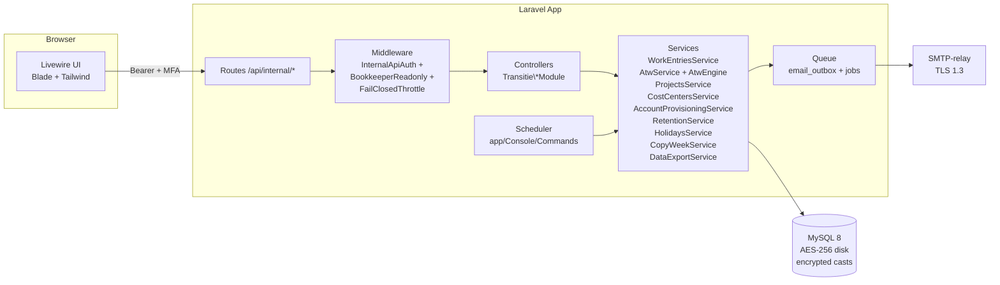
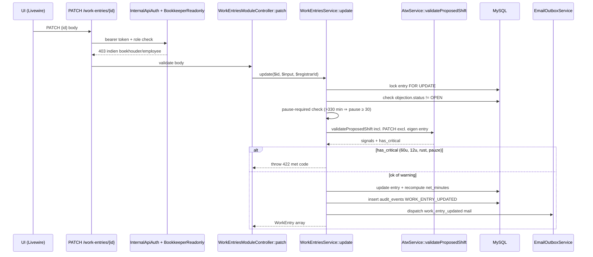
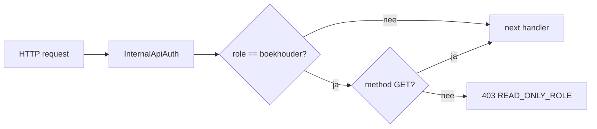
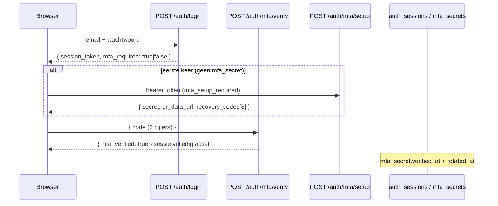
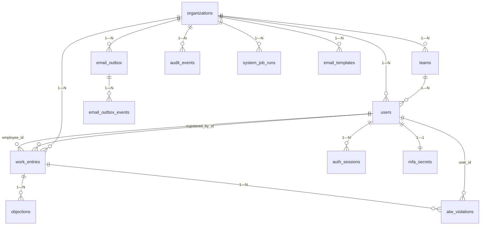
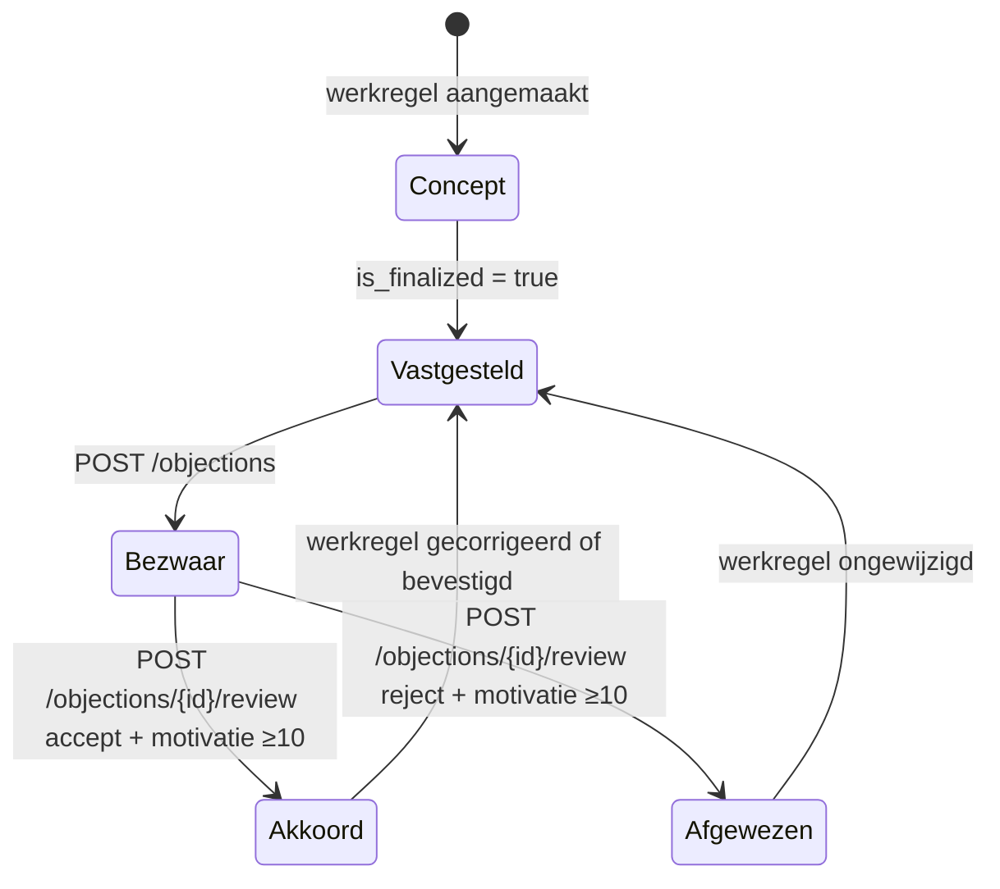

# Design Document — LaVita Urenregistratie

## Overview

Deze ontwerpnota beschrijft hoe de bestaande LaVita Urenregistratie-backend (Laravel 13, PHP 8.3, MySQL) wordt uitgebreid met de in `requirements.md` beschreven 17 requirements. De backend bestaat al uit modulaire controllers (`Transitie\*Module`) en services (`WorkEntriesService`, `AtwService`, `AtwEngine`, `AccountProvisioningService`, `EmailOutboxService`, `RetentionService`, `PendingInputReminderService`, `ReportQueryService`, `ObjectionsService`, `AuthMfaService`, `PasswordResetService`). Wat ontbreekt is (a) PATCH/DELETE/GET-single op werkregels, (b) project- en kostenplaatsmodule, (c) read-only middleware voor de boekhouder-rol, (d) ATW-validaties voor 60u-grens en pauze ≥30 min bij >5,5u, (e) welkomstmail, (f) 12 frontend-schermen, (g) verlof/feestdagen-flow + import, (h) copy-week, (i) opt-out herinneringen, (j) AVG-export en pseudonimisering, (k) jubileum-scheduler, (l) TLS+AES-encryptie + at-rest, (m) backup-cron + integriteit, (n) volledige documentatieset (technisch, handleidingen, VWO, WOR).

Het ontwerp respecteert:

- de bestaande modulestructuur (`app/Http/Controllers/Transitie/*`, `app/Services/*`, `app/Models/*`)
- het bestaande auth-pad met bearer-tokens via `InternalApiAuth` middleware en MFA-rotatie 180 dagen
- de bestaande email-outbox (append-only, met `email_outbox_events` evidence-trail en `EvidencePrivilegeVerificationService`)
- het bestaande audit-systeem (`audit_events`, evidence-tabellen met DB-level append-only guards)
- de bestaande ATW-engine (`AtwEngine`) met de 5 signaaltypes (DAILY_LIMIT, WEEKLY_WARNING, WEEKLY_LIMIT, SIXTEEN_WEEK_AVERAGE, REST_PERIOD) — uit te breiden met `PAUSE_REQUIRED`

De frontend wordt gerealiseerd met **Blade + Livewire 3** (server-rendered, geen build-stack-explosie, sluit aan op Laravel 13). Tailwind CSS 3 met design tokens uit deze nota voor styling. Overal Inter (UI) en Geist Mono (code/cijfertabel).

## Architecture

### Hoog-niveau architectuur



### Verzoekstroom werkregel-edit (PATCH)



### Boekhouder read-only middleware



### MFA-flow (bestaand, in design verankerd)



## Components and Interfaces

### Backend componenten

| Component | Verantwoordelijkheid | Routes |
|---|---|---|
| `WorkEntriesModuleController` | CRUD werkregels | `POST/GET /work-entries`, **NIEUW** `GET/PATCH/DELETE /work-entries/{id}`, **NIEUW** `POST /work-entries/copy-week` |
| `WorkEntriesService` | Validatie + opslag werkregels | `create`, **NIEUW** `update`, **NIEUW** `delete`, **NIEUW** `copyWeek` |
| `AtwService` + `AtwEngine` | ATW-controles | `validateProposedShift`, `evaluate`; **NIEUW** check `PAUSE_REQUIRED` als signaal én HTTP 422 |
| `ProjectsModuleController` (NIEUW) | CRUD projecten | `GET/POST /projects`, `GET/PATCH/DELETE /projects/{id}` |
| `ProjectsService` (NIEUW) | Validatie + autorisatie | — |
| `CostCentersModuleController` (NIEUW) | CRUD kostenplaatsen | `GET/POST /cost-centers`, `GET/PATCH/DELETE /cost-centers/{id}` |
| `CostCentersService` (NIEUW) | — | — |
| `ReportsModuleController` | Rapportages | `GET /reports/work-entries/{pdf,excel}`, **NIEUW** `GET /reports/cost-overview`, **NIEUW** `GET /reports/year-export` |
| `ReportQueryService` | Query + aggregaties | **NIEUW** `costOverview`, **NIEUW** `yearExport` |
| `AccountsModuleController` (NIEUW) | Account-CRUD met AVG | `POST /accounts` (bestond als `/auth/accounts`), **NIEUW** `DELETE /accounts/{id}`, **NIEUW** `GET /accounts/{id}/data-export` |
| `AccountProvisioningService` | Aanmaak + welkomstmail | reeds aanwezig — uitbreiden met `welcome_email` template (i.p.v. ad-hoc body) |
| `DataExportService` (NIEUW) | AVG inzage-export | `exportFor(userId)` |
| `RetentionService` | 7-jaar pseudonimisering | bestaand, uit te breiden met `pseudonymize(userId)` |
| `HolidaysModuleController` (NIEUW) | NL feestdagen | `GET /holidays?year=` |
| `HolidaysImportCommand` (NIEUW) | Artisan import | `php artisan holidays:import {year}` |
| `EmailFlowsModuleController` | Templates + dispatch | bestaand, **NIEUW** templates: `welcome_email`, `work_entry_updated`, `work_entry_deleted`, `pending_input_reminder`, `anniversary`, `atw_warning`, `atw_critical` |
| `PendingInputReminderService` + `RunPendingInputReminderCommand` | Herinneringen | bestaand, uit te breiden met opt-out check |
| `AnniversaryNotificationService` (NIEUW) + `RunAnniversaryNotificationCommand` (NIEUW) | Jubilea | dagelijks 06:00 |
| `BookkeeperReadonly` middleware (NIEUW) | Read-only afdwingen | aliased `bookkeeper.readonly` |
| `BackupVerifyCommand` (NIEUW) | Backup-integriteit | `php artisan backup:verify` |

### Frontend componenten (Livewire)

| Scherm (Req 6) | Route | Livewire-component |
|---|---|---|
| Inlog + MFA + QR | `/inloggen`, `/mfa-verify`, `/mfa-setup` | `Auth\LoginForm`, `Auth\MfaVerifyForm`, `Auth\MfaSetupQr` |
| Wachtwoord vergeten/reset | `/wachtwoord-vergeten`, `/wachtwoord-reset` | `Auth\PasswordForgotForm`, `Auth\PasswordResetForm` |
| Weekoverzicht admin/manager | `/uren/week` | `Hours\WeekOverviewTable` |
| Invoermodal (live netto + ATW) | modal binnen `Hours\WeekOverviewTable` | `Hours\EntryFormModal` |
| Medewerker-urenstaat | `/uren/mijn-week` | `Hours\MyWeek` |
| ATW-statusdashboard | `/atw` | `Atw\StatusDashboard` |
| Bezwaar beoordelen | `/bezwaren/{id}` | `Objections\ReviewForm` |
| Rapportages & export | `/rapportages` | `Reports\Filters`, `Reports\YearExport` |
| Accountbeheer | `/accounts` | `Accounts\List`, `Accounts\Form` |
| Managementdashboard | `/dashboard` | `Dashboard\ManagerHome` |
| Verlof/ziekte invoer | `/verlof` | `Hours\LeaveForm` |
| E-mailcycli beheer | `/instellingen/email` | `Settings\EmailTemplates` |

### Design tokens (verplicht in alle UI)

**Kleuren**

| Token | Hex | Gebruik |
|---|---|---|
| `--canvas` | `#FFFFFF` | Achtergrond pagina |
| `--primary` | `#0a0a0a` | Primaire CTA, tekst |
| `--on-primary` | `#FFFFFF` | Tekst op primary |
| `--brand-green` | `#00d4a4` | UITSLUITEND accent CTA + active states + focus-ring |
| `--surface` | `#f7f7f7` | Card-achtergrond, neutrale velden |
| `--hairline` | `#e5e5e5` | Borders |
| `--ink` | `#0a0a0a` | Body-tekst |
| `--steel` | `#5a5a5c` | Secundaire tekst |
| status `vastgesteld` | bg `#DCFCE7` / text `#166534` | Badge urenstatus |
| status `bezwaar` | bg `#FEF9C3` / text `#854D0E` | Badge bezwaar |
| status `concept` | bg `#f7f7f7` / text `#5a5a5c` | Badge concept/leeg |

**Typografie**

| Token | Specs | Gebruik |
|---|---|---|
| heading-2 | Inter 600, 36/1.20 | Paginatitels |
| body-md | Inter 400, 16/1.50 | Body |
| body-sm | Inter 400, 14/1.50 | Tabellen, hulpteksten |
| button-md | Inter 500, 14/1.30 | Knoptekst |
| code | Geist Mono | Tijden, tabellen, codes |

**Border-radius**

| Token | Px |
|---|---|
| button | 9999 (pill) |
| card | 12 |
| input | 8 |

**Componenten**

| Token | CSS |
|---|---|
| `button-primary` | `bg #0a0a0a; color #FFF; padding 10px 20px; border-radius 9999px;` |
| `button-secondary` | `bg transparent; color #0a0a0a; border 1px solid #e5e5e5; padding 10px 20px; border-radius 9999px;` |
| `card-base` | `bg #fff; border 1px solid #e5e5e5; border-radius 12px; padding 24px;` |
| `text-input` | `bg #fff; border 1px solid #e5e5e5; border-radius 8px; height 40px; font-size 14px;` |
| `text-input:focus` | `border 2px solid #00d4a4; outline-offset 2px;` |

**Grid**

| Breakpoint | Layout |
|---|---|
| Desktop ≥1280 | 3-koloms: sidebar 240px / content max 720px / TOC 200px |
| Tablet 768-1279 | 2-koloms: sidebar 240px / content fluid |
| Mobiel <768 | 1-koloms, hamburger-menu |
| max-width | 1280px, gutters 32px |

## Data Models

### Bestaande tabellen (relevante kolommen)



### Nieuwe tabellen

**`projects`** (Req 2)

```sql
CREATE TABLE projects (
  id BIGINT UNSIGNED PRIMARY KEY AUTO_INCREMENT,
  organization_id BIGINT UNSIGNED NOT NULL,
  code VARCHAR(40) NOT NULL,
  name VARCHAR(120) NOT NULL,
  description VARCHAR(500) NULL,
  hourly_rate DECIMAL(8,2) NULL,
  is_active BOOLEAN NOT NULL DEFAULT TRUE,
  archived_at TIMESTAMP NULL,
  created_at TIMESTAMP NULL,
  updated_at TIMESTAMP NULL,
  UNIQUE KEY uq_projects_org_code (organization_id, code),
  INDEX idx_projects_org_active (organization_id, is_active),
  CONSTRAINT fk_projects_org FOREIGN KEY (organization_id) REFERENCES organizations(id) ON DELETE CASCADE
);
```

**`cost_centers`** (Req 2)

```sql
CREATE TABLE cost_centers (
  id BIGINT UNSIGNED PRIMARY KEY AUTO_INCREMENT,
  organization_id BIGINT UNSIGNED NOT NULL,
  code VARCHAR(40) NOT NULL,
  name VARCHAR(120) NOT NULL,
  description VARCHAR(500) NULL,
  is_active BOOLEAN NOT NULL DEFAULT TRUE,
  archived_at TIMESTAMP NULL,
  created_at TIMESTAMP NULL,
  updated_at TIMESTAMP NULL,
  UNIQUE KEY uq_costc_org_code (organization_id, code),
  INDEX idx_costc_org_active (organization_id, is_active),
  CONSTRAINT fk_costc_org FOREIGN KEY (organization_id) REFERENCES organizations(id) ON DELETE CASCADE
);
```

**`work_entries` — kolom-additions** (Req 2, Req 1)

```sql
ALTER TABLE work_entries
  ADD COLUMN project_id BIGINT UNSIGNED NULL AFTER team_id,
  ADD COLUMN cost_center_id BIGINT UNSIGNED NULL AFTER project_id,
  ADD COLUMN deleted_at TIMESTAMP NULL AFTER updated_at,
  ADD INDEX idx_we_project (project_id),
  ADD INDEX idx_we_cost_center (cost_center_id),
  ADD INDEX idx_we_deleted_at (deleted_at),
  ADD CONSTRAINT fk_we_project FOREIGN KEY (project_id) REFERENCES projects(id) ON DELETE SET NULL,
  ADD CONSTRAINT fk_we_cost_center FOREIGN KEY (cost_center_id) REFERENCES cost_centers(id) ON DELETE SET NULL;
```

**`holidays`** (Req 7)

```sql
CREATE TABLE holidays (
  id BIGINT UNSIGNED PRIMARY KEY AUTO_INCREMENT,
  year SMALLINT UNSIGNED NOT NULL,
  date DATE NOT NULL,
  name VARCHAR(80) NOT NULL,
  is_national BOOLEAN NOT NULL DEFAULT TRUE,
  created_at TIMESTAMP NULL,
  updated_at TIMESTAMP NULL,
  UNIQUE KEY uq_holidays_year_date (year, date)
);
```

**`users` — kolom-additions**

| Kolom | Type | Doel |
|---|---|---|
| `email_reminders_opt_in` | BOOLEAN DEFAULT TRUE | Req 9 — opt-out per gebruiker |
| `email_index_hash` | CHAR(64) NULL UNIQUE | Req 12 — deterministische SHA-256 voor login lookup |
| `phone` | VARCHAR(40) NULL (encrypted cast) | Req 12 — optioneel |
| `deleted_at` | TIMESTAMP NULL | Req 10 — soft-delete |
| `deleted_by_id` | BIGINT UNSIGNED NULL | Req 10 — auditing |

`users.full_name`, `users.email`, `users.phone` krijgen Laravel `encrypted` cast in het User-model. Login vergelijkt op `email_index_hash = SHA2(LOWER(email), 256)`.

**`audit_events`** krijgt nieuwe `event_type`-waardes: `WORK_ENTRY_UPDATED`, `WORK_ENTRY_DELETED`, `ATW_VIOLATION_BLOCKED`, `PROJECT_CREATED/UPDATED/DELETED`, `COST_CENTER_CREATED/UPDATED/DELETED`, `ACCOUNT_PSEUDONYMIZED`, `ANNIVERSARY_DISPATCHED`, `BACKUP_INTEGRITY_FAILED`, `BACKUP_JOB_FAILED`.

**`organizations`** krijgt kolom `pending_input_threshold_days` (TINYINT UNSIGNED DEFAULT 3, CHECK 1..14).

### Email templates (uitbreiding `email_templates`)

11 templates met placeholders, NL-default-body, key kolom `type`:

| `type` | Trigger | Placeholders |
|---|---|---|
| `welcome_email` | account-create | `full_name, email, role, organization_name, login_url, reset_link, valid_hours` |
| `password_reset` | request-reset | `full_name, reset_link, valid_hours` |
| `work_entry_finalized` | POST work-entries | `full_name, entry_date, net_minutes` |
| `work_entry_updated` | PATCH work-entries | `full_name, entry_date, changes_summary` |
| `work_entry_deleted` | DELETE work-entries | `full_name, entry_date, reason` |
| `objection_review` | POST objections review | `full_name, decision, motivation` |
| `atw_warning` | ATW signal warning | `full_name, signal_type, current_minutes, threshold_minutes` |
| `atw_critical` | ATW signal critical | `full_name, signal_type, current_minutes, threshold_minutes` |
| `pending_input_reminder` | scheduler | `manager_name, employee_name, days_missing` |
| `monthly_report` | scheduler | `manager_name, period, totals_url` |
| `anniversary` | scheduler | `full_name, years, employment_start` |

### Foutcodes (HTTP 422 / 403 / 409)

| Code | HTTP | Bron |
|---|---|---|
| `ATW_PAUSE_REQUIRED` | 422 | Req 4.1 |
| `ATW_WEEKLY_MAX_EXCEEDED` | 422 | Req 4.3 |
| `ATW_DAILY_MAX_EXCEEDED` | 422 | Req 4.4 |
| `ATW_REST_PERIOD_VIOLATED` | 422 | Req 4.5 |
| `READ_ONLY_ROLE` | 403 | Req 3 |
| `FORBIDDEN_ROLE` | 403 | Req 1, 2, 8 |
| `FORBIDDEN_TEAM_SCOPE` | 403 | Req 1.2 |
| `FORBIDDEN_OWNER_SCOPE` | 403 | Req 1.3 |
| `FORBIDDEN_DATA_EXPORT` | 403 | Req 10.4 |
| `OBJECTION_OPEN` | 409 | Req 1.8 |
| `OPEN_OBJECTIONS` | 409 | Req 10.7 |
| `PROJECT_ORG_MISMATCH` | 422 | Req 2.9 |
| `COST_CENTER_ORG_MISMATCH` | 422 | Req 2.9 |
| `PROJECT_INACTIVE` | 422 | Req 2.10 |
| `COST_CENTER_INACTIVE` | 422 | Req 2.10 |
| `INVALID_TYPE_FOR_ROLE` | 422 | Req 7.2 |
| `SOURCE_WEEK_EMPTY` | 422 | Req 8.2 |
| `WELCOME_EMAIL_FAILED` | 500 | Req 5.4 |

## Scheduler-jobs (overzicht)

| Job | Cron (Europe/Amsterdam) | Console-command |
|---|---|---|
| Backup | dagelijks 02:00 | `backup:run` (spatie/laravel-backup) |
| Backup-integriteit | dagelijks 03:00 | `backup:verify` (NIEUW) |
| Pending-input herinnering | dagelijks 08:00 | `RunPendingInputReminderCommand` (uitbreiden) |
| Jubilea | dagelijks 06:00 | `RunAnniversaryNotificationCommand` (NIEUW) |
| Maandelijkse rapportage | maandelijks 1e 04:00 | bestaand `MonthlyReportRun` mechanisme |
| Retentie + pseudonimisering | maandelijks 1e 03:00 | `RunRetentionCommand` (uitbreiden) |
| Email-evidence integriteit | dagelijks 04:00 | `RunEmailEvidenceIntegrityCommand` (bestaand) |

## Encryptie- en TLS-strategie

- **In transit:** TLS 1.3 op Cloud86/Plesk; cipher `TLS_AES_256_GCM_SHA384`, `TLS_CHACHA20_POLY1305_SHA256`, `TLS_AES_128_GCM_SHA256`. HSTS `max-age=31536000; includeSubDomains; preload`. HTTP→HTTPS 308 redirect via Plesk-rule.
- **At-rest (host):** MySQL data-directory op LUKS-versleutelde volume (Cloud86-hostingstap, gedocumenteerd in `docs/technical/infrastructuur.md`).
- **At-rest (applicatie):** Laravel `encrypted` cast op `users.full_name`, `users.email`, `users.phone` met `APP_KEY` (AES-256-CBC) + `APP_PREVIOUS_KEYS` voor rotatie.
- **E-mail lookups:** deterministische SHA-256 hash in `users.email_index_hash` (uniek per kolom), gevuld via migratie + observer; encrypted email zelf wordt nooit als index gebruikt.
- **Sleutelbeheer:** `APP_KEY` in `.env` met `chmod 600`; rotatie elke 12 maanden via `php artisan key:rotate` (bestaande Laravel-feature) met behoud van `APP_PREVIOUS_KEYS` 90 dagen.
- **Backup-encryptie:** `spatie/laravel-backup` met `encryption: aes-256-cbc` en sleutel los van `APP_KEY` (`BACKUP_ARCHIVE_PASSWORD` env).

## Email-systeem

Bestaand: `email_outbox` (append-only, idempotency-key, evidence-trail). Voor `welcome_email` wordt `EmailTemplateService::render($type, $vars)` aangeroepen i.p.v. ad-hoc body in `AccountProvisioningService`. Templates blijven bewerkbaar via `PUT /api/internal/email/templates/{type}` met versie-bewust archief (`email_template_versions`, indien nog niet aanwezig: aanmaken).

Retry-policy: bestaande worker; default 5 retries, exponential backoff. Pseudonimisering log na 7 jaar via `RunRetentionCommand`.

## Bezwaarprocedure (bestaand, in design verankerd)




## Correctness Properties

*Een property is een eigenschap of gedrag dat universeel waar moet zijn over alle geldige uitvoeringen van het systeem — een formele uitspraak over wat het systeem moet doen. Properties vormen de brug tussen leesbare specificaties en machine-verifieerbare correctheidsgaranties.*

PBT IS van toepassing op de pure-functie-componenten in deze feature: ATW-engine, netto-minuten-berekening, copy-week-transformatie, project-aggregaties (cost-overview), feestdagen-berekening, welcome-mail-rendering, encryptie-roundtrip en pseudonimisering. PBT is NIET van toepassing op het visuele renderen van Livewire-schermen, op TLS- en backup-cron (infrastructuur), op documentatie-deliverables, en op de meeste autorisatie-rules; daarvoor gebruiken we voorbeeldgebaseerde tests, snapshot-tests en integratie-tests (zie Testing Strategy).

### Property 1: Netto-minuten-berekening klopt

*Voor elke* `(start_time, end_time, pause_minutes)` met `end_time > start_time` op dezelfde datum en `pause_minutes ∈ [0, 240]`, geldt na `POST` of `PATCH` op `/api/internal/work-entries(/{id})` dat `net_minutes == max(0, ((end_time - start_time)_minutes) - pause_minutes)`.

**Validates: Requirements 1.4**

### Property 2: Cost-overview-aggregatie is correct

*Voor elke* willekeurige set werkregels met `project_id` en `hourly_rate`, retourneert `GET /api/internal/reports/cost-overview` per project `total_minutes = SUM(net_minutes)`, `total_hours = total_minutes/60`, en `total_cost = total_hours * hourly_rate` (of `null` indien `hourly_rate` is `null`), waarbij de gegroepeerde sommen exact overeenkomen met de handmatige som over de gefilterde werkregels.

**Validates: Requirements 2.8**

### Property 3: Boekhouder is read-only over alle non-GET methodes

*Voor elke* HTTP-methode `m ∈ {POST, PUT, PATCH, DELETE}` en elke endpoint binnen `/api/internal/*` (excl. `/auth/logout`), levert een verzoek door een gebruiker met rol `boekhouder` HTTP 403 met code `READ_ONLY_ROLE`.

**Validates: Requirements 3.3, 3.4, 3.5, 3.6**

### Property 4: ATW-pauzeplicht wordt afgedwongen

*Voor elke* shift-input `(start, end, pause_minutes)` waarvoor `(end - start)_minutes > 330` (5,5u) en `pause_minutes < 30`, levert `POST` of `PATCH` op `/api/internal/work-entries(/{id})` HTTP 422 met code `ATW_PAUSE_REQUIRED`, en de werkregel is niet aanwezig in `work_entries`.

**Validates: Requirements 4.1**

### Property 5: 60u-weekgrens blokkeert hard

*Voor elke* combinatie van bestaande shifts en proposed shift waarbij de som van `net_minutes` binnen dezelfde ISO-week (ma-zo) ≥ `3600` minuten wordt, levert `POST` of `PATCH` HTTP 422 met code `ATW_WEEKLY_MAX_EXCEEDED` en is de proposed shift afwezig in de database.

**Validates: Requirements 4.3**

### Property 6: ATW-engine produceert juiste signals per drempel

*Voor elke* `(proposedShift, existingShifts, policy)` produceert `AtwEngine::evaluate(...)` een lijst signals die voldoet aan: (a) `DAILY_LIMIT` ⇔ `proposedShift.net_minutes ≥ policy.daily_max_minutes`; (b) `WEEKLY_WARNING` ⇔ `weeklyMinutes ∈ [policy.weekly_warning_minutes, policy.weekly_max_minutes)`; (c) `WEEKLY_LIMIT` ⇔ `weeklyMinutes ≥ policy.weekly_max_minutes`; (d) `SIXTEEN_WEEK_AVERAGE` ⇔ `floor(total16w/16) ≥ policy.average_16_week_minutes`; (e) `REST_PERIOD` ⇔ er is een vorige shift waarvan `(proposedStart - prevEnd)_minutes < 660`; (f) elke gevonden signal heeft `severity == 'warning'` voor `WEEKLY_WARNING` en `severity == 'critical'` voor de andere vier.

**Validates: Requirements 4.2, 4.4, 4.5, 4.6, 4.9**

### Property 7: Validate-ATW en POST/PATCH zijn consistent

*Voor elke* shift-input `X`, geldt: `POST /api/internal/work-entries/validate-atw` met `X` retourneert `has_critical == true` als en alleen als `POST /api/internal/work-entries` met dezelfde `X` HTTP 422 met een ATW-foutcode levert.

**Validates: Requirements 4.8**

### Property 8: Welkomstmail render is volledig en lekt geen wachtwoord

*Voor elke* `(full_name, email, role, organization_name, login_url, reset_link, valid_hours)` aan `EmailTemplateService::render('welcome_email', vars)`, geldt: (a) de gerenderde `body_text` en `body_html` bevatten geen substring matching pattern `\{\{\s*\w+\s*\}\}` (geen onverwerkte placeholders); (b) elke placeholder-waarde uit `vars` komt minstens één keer voor in `body_text` of `body_html`; (c) het random-gegenereerde initieel wachtwoord van het account verschijnt nergens als substring in de mail.

**Validates: Requirements 5.1, 5.3, 5.5**

### Property 9: SICK/LEAVE/HOLIDAY tellen niet mee in ATW-werktijd

*Voor elke* lijst werkregels van een medewerker, geldt dat de ATW-werktijd-totalen (`weeklyMinutes`, `total16Weeks`, `daily`) uitsluitend werkregels met `type = 'WORK'` sommeren; werkregels met `type ∈ {SICK, LEAVE, HOLIDAY, OTHER}` dragen 0 minuten bij aan deze totalen.

**Validates: Requirements 7.8**

### Property 10: Holidays-import berekent NL-feestdagen correct

*Voor elk* jaar `Y ∈ [1900, 2099]`, produceert `php artisan holidays:import {Y}` exact de set Nederlandse nationale feestdagen volgens de algoritmische definitie: Nieuwjaarsdag (01-01), Goede Vrijdag (Pasen-2), Eerste Paasdag (Gauss-Pasen), Tweede Paasdag (Pasen+1), Koningsdag (27-04, of 26-04 als 27-04 zondag is), Bevrijdingsdag indien `Y mod 5 == 0` (05-05), Hemelvaart (Pasen+39), Eerste Pinksterdag (Pasen+49), Tweede Pinksterdag (Pasen+50), Eerste Kerstdag (25-12), Tweede Kerstdag (26-12).

**Validates: Requirements 7.5**

### Property 11: Copy-week verschuift entries 7 dagen voorwaarts

*Voor elke* willekeurige bron-week werkregels van type `WORK` (zonder ATW-kritiek-signalen op de doel-week, en zonder bestaande conflicten in de doel-week), geldt na `POST /api/internal/work-entries/copy-week`: `created.length == bron.length`, en voor elke gekopieerde entry `c_i` bestaat een bron-entry `b_i` met `c_i.entry_date == b_i.entry_date + 7d`, `c_i.start_at == b_i.start_at + 7d`, `c_i.end_at == b_i.end_at + 7d`, en `c_i.net_minutes == b_i.net_minutes`.

**Validates: Requirements 8.1**

### Property 12: Copy-week conflicts en ATW-blokkades verschijnen in skipped[]

*Voor elke* copy-week-aanroep, geldt: voor elke bron-entry `b` waarvoor in de doel-week reeds een entry op `(employee_id, target_date, start_time)` bestaat, verschijnt `b` in `skipped[]` met `reason == 'DUPLICATE'`; voor elke bron-entry `b` waarvoor de gekopieerde versie een ATW-`severity: critical`-signal zou veroorzaken, verschijnt `b` in `skipped[]` met `reason == 'ATW_BLOCKED'`; én `created.length + skipped.length == bron.length`.

**Validates: Requirements 8.3, 8.4**

### Property 13: Pending-input-reminder respecteert opt-out en threshold

*Voor elke* run van de scheduler met `threshold_days = N` en willekeurige werkhistorie per medewerker, geldt: voor iedere actieve medewerker `e` met `email_reminders_opt_in == true` die in de afgelopen `N` werkdagen (ma-vr) geen `WORK`-werkregels heeft, ontstaat exact één outbox-mail van type `pending_input_reminder` voor de manager(s) van diens team; voor elke medewerker met `email_reminders_opt_in == false` ontstaat geen `pending_input_reminder` of `monthly_report` mail.

**Validates: Requirements 9.4, 9.5**

### Property 14: Pseudonimisering behoudt urenintegriteit

*Voor elke* gebruiker `u` met willekeurige werkregels en bezwaren, geldt na `DELETE /api/internal/accounts/{u.id}`: `count(work_entries WHERE employee_id = u.id)` is onveranderd, `sum(net_minutes WHERE employee_id = u.id)` is onveranderd, `count(objections WHERE work_entry_id IN ...)` is onveranderd; én `users.email`, `users.full_name`, `users.phone` zijn vervangen door pseudonieme waarden die niet de oorspronkelijke waarden bevatten als substring.

**Validates: Requirements 10.1, 10.2**

### Property 15: Data-export bevat alle gegevens van de gebruiker

*Voor elke* gebruiker `u` met werkregels, bezwaren, atw-violations en audit-events, retourneert `GET /api/internal/accounts/{u.id}/data-export` een JSON-object waarvan: `work_entries[]` exact gelijk is aan `SELECT * FROM work_entries WHERE employee_id = u.id`, `objections[]` exact gelijk is aan de bezwaren gekoppeld aan die werkregels, `atw_violations[]` exact gelijk is aan `WHERE user_id = u.id`, en `audit_events[]` minimaal alle records met `actor_id = u.id` of `target_user_id = u.id` bevat.

**Validates: Requirements 10.3**

### Property 16: Jubileumdetectie voor jaren {1,5,10,25}

*Voor elke* `today` (datum) en willekeurige set `users` met `employment_start`, geldt: het aantal `anniversary`-mails dat de scheduler genereert is gelijk aan `count(u in users where u.is_active && u.employment_start.month == today.month && u.employment_start.day == today.day && (today.year - u.employment_start.year) ∈ {1, 5, 10, 25})`.

**Validates: Requirements 11.2, 11.3**

### Property 17: Encryptie-roundtrip op users.email/full_name/phone

*Voor elke* string `s` met lengte 1..255 en geldige UTF-8, geldt: `User::create(['email' => s, ...])` gevolgd door `User::find($id)->email` retourneert `s`; én `SELECT email FROM users WHERE id = $id` (raw SQL) retourneert een base64-payload die `s` niet bevat als substring; én `SELECT email_index_hash FROM users WHERE id = $id` is gelijk aan `hash('sha256', strtolower($s))`.

**Validates: Requirements 12.1, 12.2**

## Error Handling

| Foutbron | Strategie |
|---|---|
| ATW-overschrijding (kritiek) | HTTP 422 met specifieke `code`, audit-event `ATW_VIOLATION_BLOCKED`, geen DB-write |
| ATW-overschrijding (warning) | DB-write toegestaan, `atw_violations`-record met `severity=warning`, mail-dispatch via outbox |
| Autorisatie | HTTP 403 met code `READ_ONLY_ROLE` / `FORBIDDEN_ROLE` / `FORBIDDEN_TEAM_SCOPE` / `FORBIDDEN_OWNER_SCOPE` |
| Conflict (objection open) | HTTP 409 met code `OBJECTION_OPEN` / `OPEN_OBJECTIONS` |
| Validatie-fout (project/cost-center mismatch) | HTTP 422 met specifieke `code`; geen partial write |
| Outbox-fout bij welkomstmail | DB-transactie rollback; HTTP 500 met code `WELCOME_EMAIL_FAILED` |
| MFA-rotatie verlopen | HTTP 403 met code `MFA_ROTATION_REQUIRED` (bestaand) |
| Backup-integriteit faalt | Audit-event + alert-mail; geen end-user impact |
| Ongedefinieerde 500 | Generieke handler in `app/Exceptions/Handler.php`; logt naar `storage/logs/laravel.log` met request-id, geen stacktrace naar client |

Alle response-bodies bij 4xx volgen formaat:

```json
{ "error": "Mensleesbare NL-melding", "code": "MACHINE_LEESBARE_CODE", "errors": { "veld": ["specifieke foutmelding"] } }
```

## Testing Strategy

### Aanpak

LaVita Urenregistratie hanteert een **drielagige teststrategie**:

1. **Unit & property tests** — Pest of PHPUnit, in-memory SQLite voor de meeste tests, MySQL bij encryptie-tests; dekken pure businesslogica (ATW-engine, copy-week, holidays-berekening, mail-rendering, pseudonimisering, encryptie-roundtrip).
2. **Feature/integration tests** — Laravel HTTP-tests, dekken endpoints en autorisatie-rules per rol; per scherm minimaal één Livewire-feature-test.
3. **Browser smoke** — Pest browser plugin (of Laravel Dusk), 1 happy-path per kritiek scherm, axe-core run voor WCAG-validatie.

### Property-Based Testing-bibliotheek

- Bibliotheek: **`pestphp/pest-plugin-properties`** (bovenop Pest v3) of `eris-php` als fallback.
- Minimale iteraties: **100 per property-test**; ATW-properties draaien 200 iteraties wegens complexere generatoren.
- Elke property-test krijgt een tag-comment in PHPDoc-stijl:
  
  ```php
  /**
   * @feature lavita-urenregistratie
   * @property 6 ATW-engine produceert juiste signals per drempel
   * @validates Requirements 4.2, 4.4, 4.5, 4.6, 4.9
   */
  ```

- Generatoren: Carbon-datums binnen `[2020-01-01, 2030-12-31]`, durations `[1, 1440]` minuten, pauzes `[0, 240]`, weeklymax-policies vast op orgs-defaults (`daily_max_minutes=720`, `weekly_warning_minutes=2880`, `weekly_max_minutes=3600`, `average_16_week_minutes=2880`).

### Voorbeeldgebaseerde unit/feature-tests

- Per CRUD-endpoint: happy path + autorisatie-403 + 404 (`Tests\Feature\Internal\WorkEntriesTest` etc).
- Per Livewire-component: één test voor render + één voor interactie (`Tests\Feature\Ui\WeekOverviewTableTest` etc).
- Per scheduler-command: één test voor "draait zonder fout" + één voor het hoofdpad (`Tests\Feature\Console\HolidaysImportCommandTest`).

### Integration tests

- WCAG-axe-run via browser-test op de 12 kritieke schermen.
- Backup-job dry-run tegen lokale storage adapter.
- TLS-/HSTS-/redirect-checks via curl-script in CI tegen staging.

### Smoke tests

- Migratie-smoke: alle migrations uit/in.
- Documentatie-smoke: bestaan en linkcheck van de 9 documenten in Requirement 14-17.

### Tellingen per testtype (richtlijn)

| Testtype | Aantal |
|---|---|
| Property tests | 17 (één per Property) |
| Feature/integration tests | ~80 (CRUD + autorisatie + Livewire) |
| Browser/WCAG smoke | 12 (één per scherm) |
| Console-smoke | ~6 (per scheduler-command) |
| Migratie-smoke | 1 |

