# Datamodel — LaVita Urenregistratie

## Overzicht

Dit document beschrijft het volledige datamodel van de LaVita Urenregistratie-applicatie. Het ER-diagram toont alle tabellen, hun kolommen en onderlinge relaties.

---

## ER-diagram (Mermaid)

```mermaid
erDiagram
    organizations {
        bigint id PK
        varchar name
        varchar kvk_number "8 tekens, nullable"
        varchar loonheffingennummer "12 tekens, nullable"
        varchar default_timezone "default Europe/Amsterdam"
        smallint retention_years "default 7"
        smallint atw_daily_max_minutes "default 720"
        smallint atw_weekly_max_minutes "default 3600"
        smallint atw_weekly_warning_minutes "default 2880"
        smallint atw_average_16_week_minutes "default 2880"
        tinyint pending_input_threshold_days "default 3, CHECK 1..14"
        timestamp created_at
        timestamp updated_at
    }

    teams {
        bigint id PK
        bigint organization_id FK
        varchar name
        bigint manager_id FK "nullable"
        timestamp created_at
        timestamp updated_at
    }

    users {
        bigint id PK
        varchar name
        varchar full_name "nullable, encrypted"
        bigint organization_id FK "nullable"
        bigint team_id FK "nullable"
        varchar role "owner|manager|employee|boekhouder"
        boolean is_active "default true"
        boolean email_reminders_opt_in "default true"
        date employment_start "nullable"
        date employment_end "nullable"
        text email "encrypted"
        char email_index_hash "64, SHA-256, unique"
        varchar phone "40, nullable, encrypted"
        varchar password
        timestamp email_verified_at "nullable"
        varchar remember_token "nullable"
        timestamp deleted_at "nullable, soft-delete"
        bigint deleted_by_id FK "nullable"
        timestamp created_at
        timestamp updated_at
    }

    projects {
        bigint id PK
        bigint organization_id FK
        varchar code "40, uniek per org"
        varchar name "120"
        varchar description "500, nullable"
        decimal hourly_rate "8-2, nullable"
        boolean is_active "default true"
        timestamp archived_at "nullable"
        timestamp created_at
        timestamp updated_at
    }

    cost_centers {
        bigint id PK
        bigint organization_id FK
        varchar code "40, uniek per org"
        varchar name "120"
        varchar description "500, nullable"
        boolean is_active "default true"
        timestamp archived_at "nullable"
        timestamp created_at
        timestamp updated_at
    }

    work_entries {
        bigint id PK
        bigint organization_id FK
        bigint employee_id FK
        bigint team_id FK "nullable"
        bigint project_id FK "nullable, ON DELETE SET NULL"
        bigint cost_center_id FK "nullable, ON DELETE SET NULL"
        bigint registered_by_id FK
        date entry_date
        timestamp start_at
        timestamp end_at
        smallint pause_minutes "default 0"
        smallint net_minutes
        varchar type "WORK|SICK|LEAVE|HOLIDAY|OTHER"
        varchar note "500, nullable"
        boolean is_finalized "default true"
        timestamp deleted_at "nullable, soft-delete"
        timestamp created_at
        timestamp updated_at
    }

    objections {
        bigint id PK
        bigint organization_id FK
        bigint work_entry_id FK
        bigint submitted_by_id FK
        bigint reviewed_by_id FK "nullable"
        text motivation
        text manager_response "nullable"
        varchar status "OPEN|APPROVED|REJECTED"
        timestamp submitted_at
        timestamp reviewed_at "nullable"
        timestamp created_at
        timestamp updated_at
    }

    atw_violations {
        bigint id PK
        bigint organization_id FK
        bigint user_id FK
        bigint work_entry_id FK "nullable"
        varchar violation_type "30"
        varchar severity "warning|critical"
        date period_start
        date period_end
        smallint current_minutes
        smallint threshold_minutes
        varchar details "500, nullable"
        timestamp superseded_at "nullable"
        timestamp created_at
    }

    holidays {
        bigint id PK
        smallint year
        date date
        varchar name "80"
        boolean is_national "default true"
        timestamp created_at
        timestamp updated_at
    }

    auth_sessions {
        bigint id PK
        bigint user_id FK
        varchar session_token_hash "255, unique"
        varchar ip_address "45, nullable"
        text user_agent "nullable"
        timestamp last_seen_at "nullable"
        timestamp expires_at
        timestamp revoked_at "nullable"
        timestamp created_at
        timestamp updated_at
    }

    mfa_secrets {
        bigint id PK
        bigint user_id FK "unique"
        varchar secret_encrypted "512"
        varchar issuer "120"
        varchar label "190"
        timestamp verified_at "nullable"
        timestamp rotated_at "nullable"
        timestamp disabled_at "nullable"
        timestamp created_at
        timestamp updated_at
    }

    mfa_recovery_codes {
        bigint id PK
        bigint user_id FK
        varchar code_hash "255"
        timestamp used_at "nullable"
        timestamp created_at
        timestamp updated_at
    }

    email_outbox {
        bigint id PK
        varchar idempotency_key "128, unique"
        bigint organization_id FK "nullable"
        bigint user_id FK "nullable"
        bigint initiator_actor_id FK "nullable"
        varchar initiator_role_snapshot "30, nullable"
        bigint initiator_org_id_snapshot "nullable"
        bigint monthly_report_run_id FK "nullable"
        varchar request_id "100, nullable"
        varchar source_ip "45, nullable"
        varchar user_agent "500, nullable"
        varchar correlation_id "64, nullable"
        varchar recipient "255"
        varchar subject "500"
        varchar subject_sha256 "64, nullable"
        text body_text
        varchar body_text_sha256 "64, nullable"
        text body_html
        varchar body_html_sha256 "64, nullable"
        varchar type "80, default custom"
        json attachments "nullable"
        enum status "queued|retrying|sent|failed"
        smallint retry_count "default 0"
        timestamp next_attempt_at
        timestamp sent_at "nullable"
        timestamp scrubbed_at "nullable"
        text error_message "nullable"
        timestamp created_at
        timestamp updated_at
    }

    email_outbox_events {
        bigint id PK
        bigint outbox_id FK
        varchar event_type "40"
        bigint actor_id FK "nullable"
        varchar request_id "100, nullable"
        varchar source_ip "45, nullable"
        varchar user_agent "500, nullable"
        varchar correlation_id "64, nullable"
        json payload "nullable"
        varchar previous_event_hash "64, nullable"
        varchar event_hash "64"
        timestamp occurred_at
        timestamp created_at
        timestamp updated_at
    }

    email_templates {
        bigint id PK
        bigint organization_id FK
        varchar type "80"
        varchar subject_template "500"
        text body_text_template
        text body_html_template
        boolean is_active "default true"
        bigint updated_by_actor_id "nullable"
        timestamp created_at
        timestamp updated_at
    }

    audit_events {
        bigint id PK
        bigint organization_id FK
        bigint actor_id FK
        varchar action "100"
        varchar target_type "100"
        varchar target_id "100"
        json before_data "nullable"
        json after_data "nullable"
        varchar request_id "100, nullable"
        varchar ip_address "45, nullable"
        varchar user_agent "500, nullable"
        timestamp scrubbed_at "nullable"
        timestamp created_at
    }

    system_job_runs {
        bigint id PK
        bigint organization_id FK "nullable"
        varchar job_name "120"
        varchar status "20"
        timestamp started_at "nullable"
        timestamp finished_at "nullable"
        int duration_ms "nullable"
        int rows_affected "default 0"
        json details "nullable"
        text error_message "nullable"
        timestamp created_at
        timestamp updated_at
    }

    monthly_report_runs {
        bigint id PK
        bigint organization_id FK
        varchar period_month "7, YYYY-MM"
        bigint requested_by_actor_id FK "nullable"
        varchar request_id "100, nullable"
        varchar source_ip "45, nullable"
        varchar user_agent "500, nullable"
        varchar correlation_id "64, nullable"
        varchar dedupe_key "191"
        timestamp created_at
        timestamp updated_at
    }

    %% Relaties
    organizations ||--o{ teams : "heeft"
    organizations ||--o{ users : "heeft"
    organizations ||--o{ projects : "heeft"
    organizations ||--o{ cost_centers : "heeft"
    organizations ||--o{ work_entries : "heeft"
    organizations ||--o{ objections : "heeft"
    organizations ||--o{ atw_violations : "heeft"
    organizations ||--o{ email_outbox : "heeft"
    organizations ||--o{ email_templates : "heeft"
    organizations ||--o{ audit_events : "heeft"
    organizations ||--o{ system_job_runs : "heeft"
    organizations ||--o{ monthly_report_runs : "heeft"

    teams ||--o{ users : "bevat"
    teams }o--|| users : "manager_id"

    users ||--o{ work_entries : "employee_id"
    users ||--o{ work_entries : "registered_by_id"
    users ||--o{ objections : "submitted_by_id"
    users ||--o{ objections : "reviewed_by_id"
    users ||--o{ atw_violations : "user_id"
    users ||--o{ auth_sessions : "heeft"
    users ||--|| mfa_secrets : "heeft"
    users ||--o{ mfa_recovery_codes : "heeft"
    users ||--o{ audit_events : "actor_id"
    users }o--o| users : "deleted_by_id"

    projects ||--o{ work_entries : "project_id"
    cost_centers ||--o{ work_entries : "cost_center_id"

    work_entries ||--o{ objections : "heeft"
    work_entries ||--o{ atw_violations : "heeft"

    email_outbox ||--o{ email_outbox_events : "heeft"
```

---

## Tabelbeschrijvingen

### organizations

Bevat de organisatiegegevens en configuratie-instellingen voor ATW-drempels en retentie.

| Kolom | Type | Beschrijving |
|-------|------|--------------|
| `id` | BIGINT PK | Primaire sleutel |
| `name` | VARCHAR | Organisatienaam |
| `kvk_number` | VARCHAR(8) | KvK-nummer (optioneel) |
| `loonheffingennummer` | VARCHAR(12) | Loonheffingennummer (optioneel) |
| `default_timezone` | VARCHAR(50) | Standaard tijdzone (default: Europe/Amsterdam) |
| `retention_years` | SMALLINT | Bewaartermijn in jaren (default: 7) |
| `atw_daily_max_minutes` | SMALLINT | ATW daglimiet in minuten (default: 720 = 12u) |
| `atw_weekly_max_minutes` | SMALLINT | ATW harde weekgrens (default: 3600 = 60u) |
| `atw_weekly_warning_minutes` | SMALLINT | ATW weekwaarschuwing (default: 2880 = 48u) |
| `atw_average_16_week_minutes` | SMALLINT | ATW 16-weken gemiddelde (default: 2880 = 48u) |
| `pending_input_threshold_days` | TINYINT | Drempel voor herinneringen (default: 3, range 1–14) |

### teams

Teams binnen een organisatie, elk met een optionele manager.

### users

Gebruikersaccounts met versleutelde persoonsgegevens (AVG). Ondersteunt soft-delete voor pseudonimisering.

**Versleutelde kolommen:** `full_name`, `email`, `phone` (Laravel `encrypted` cast, AES-256-CBC).  
**Lookup:** `email_index_hash` = SHA-256 van lowercase e-mailadres.

### projects

Projecten voor kostprijsberekening. Unieke code per organisatie. Soft-archivering via `archived_at`.

### cost_centers

Kostenplaatsen voor kostprijsberekening. Structuur identiek aan `projects` (zonder `hourly_rate`).

### holidays

Nederlandse nationale feestdagen per jaar. Gevuld via `php artisan holidays:import {year}`.

**Uniek-index:** `(year, date)` — voorkomt dubbele invoer.

### work_entries

Werkregels (diensten). Eén record per medewerker per dienst/dag. Ondersteunt soft-delete en koppeling aan project/kostenplaats.

**Uniek-index:** `(employee_id, entry_date, start_at)` — voorkomt dubbele registraties.

### objections

Bezwaren van medewerkers tegen vastgestelde werkregels. Status-flow: OPEN → APPROVED of REJECTED.

### atw_violations

ATW-signalen (waarschuwingen en overtredingen). Worden bij verwijdering van de bron-werkregel gemarkeerd als `superseded`.

### auth_sessions

Bearer-token sessies voor API-authenticatie. Tokens worden gehashed opgeslagen.

### mfa_secrets

TOTP MFA-secrets per gebruiker. Versleuteld opgeslagen. Rotatie elke 180 dagen.

### mfa_recovery_codes

Eenmalige recovery-codes voor MFA. Gehashed opgeslagen; `used_at` markeert gebruik.

### email_outbox

Append-only e-mail outbox met idempotency, retry-mechanisme en evidence-trail (SHA-256 hashes).

### email_outbox_events

Onveranderbare event-log per outbox-mail. Hash-chain voor integriteitsverificatie.

### email_templates

Bewerkbare e-mailtemplates per organisatie en type. 11 standaardtypes beschikbaar.

### audit_events

Onveranderbare auditlog. Alle schrijfacties worden gelogd met actor, doel en voor/na-data.

### system_job_runs

Registratie van scheduler-jobs (backup, retentie, herinneringen, etc.) met status en duur.

### monthly_report_runs

Deduplicatie-tabel voor maandelijkse rapportage-jobs.

---

## Indexen en constraints

### Unieke indexen

| Tabel | Index | Kolommen |
|-------|-------|----------|
| `projects` | `uq_projects_org_code` | `(organization_id, code)` |
| `cost_centers` | `uq_costc_org_code` | `(organization_id, code)` |
| `holidays` | `uq_holidays_year_date` | `(year, date)` |
| `work_entries` | `uq_work_entry_employee_date_start` | `(employee_id, entry_date, start_at)` |
| `objections` | `uq_objection_open_per_entry` | `(work_entry_id, status)` |
| `email_outbox` | `idempotency_key` | `(idempotency_key)` |
| `email_templates` | `uniq_email_template_org_type` | `(organization_id, type)` |
| `users` | `email_index_hash` | `(email_index_hash)` |

### Foreign keys met ON DELETE gedrag

| Bron | Kolom | Doel | ON DELETE |
|------|-------|------|----------|
| `work_entries` | `project_id` | `projects.id` | SET NULL |
| `work_entries` | `cost_center_id` | `cost_centers.id` | SET NULL |
| `work_entries` | `employee_id` | `users.id` | (restrict) |
| `objections` | `work_entry_id` | `work_entries.id` | CASCADE |
| `objections` | `submitted_by_id` | `users.id` | CASCADE |
| `objections` | `reviewed_by_id` | `users.id` | SET NULL |
| `atw_violations` | `work_entry_id` | `work_entries.id` | SET NULL |
| `projects` | `organization_id` | `organizations.id` | CASCADE |
| `cost_centers` | `organization_id` | `organizations.id` | CASCADE |
| `users` | `deleted_by_id` | `users.id` | SET NULL |

---

## Encryptie

| Kolom | Methode | Doel |
|-------|---------|------|
| `users.full_name` | Laravel `encrypted` cast (AES-256-CBC) | AVG at-rest bescherming |
| `users.email` | Laravel `encrypted` cast (AES-256-CBC) | AVG at-rest bescherming |
| `users.phone` | Laravel `encrypted` cast (AES-256-CBC) | AVG at-rest bescherming |
| `users.email_index_hash` | SHA-256 (deterministisch) | Lookup zonder decryptie |
| `mfa_secrets.secret_encrypted` | Applicatie-encryptie | TOTP-secret bescherming |
| MySQL data-directory | LUKS full-disk encryption | Fysieke toegangsbeveiliging |

---

*Versie: mei 2026*
