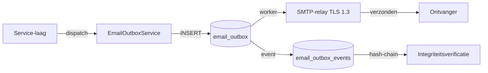
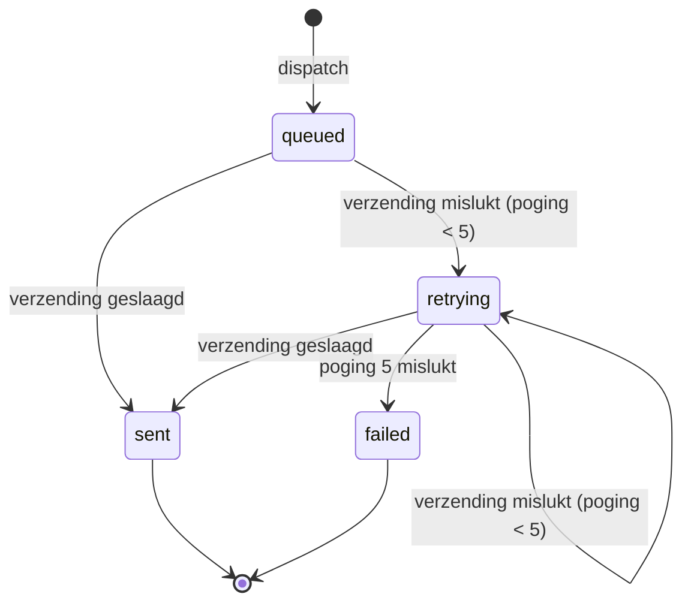

# E-mailsysteem — LaVita Urenregistratie

## Overzicht

Het e-mailsysteem van LaVita Urenregistratie is gebaseerd op een append-only outbox-patroon met idempotency, retry-mechanisme en een onveranderbare evidence-trail. Alle e-mails worden eerst in de `email_outbox`-tabel geplaatst en vervolgens asynchroon verzonden via een SMTP-relay.

---

## Architectuur



### Componenten

| Component | Verantwoordelijkheid |
|-----------|---------------------|
| `EmailOutboxService` | Dispatch naar outbox, idempotency-check, retry-logica |
| `EmailTemplateService` | Template-rendering met placeholders |
| `EmailFlowsModuleController` | API voor template-beheer en handmatige dispatch |
| `RunEmailEvidenceIntegrityCommand` | Dagelijkse hash-chain verificatie |
| `email_outbox` (tabel) | Append-only opslag van alle uitgaande e-mails |
| `email_outbox_events` (tabel) | Onveranderbare event-log per mail |

---

## Templates (11 types)

| # | Type | Trigger | Onderwerp (standaard) | Placeholders |
|---|------|---------|----------------------|--------------|
| 1 | `welcome_email` | Account aangemaakt (`POST /auth/accounts`) | "Welkom bij LaVita Urenregistratie" | `full_name`, `email`, `role`, `organization_name`, `login_url`, `reset_link`, `valid_hours` |
| 2 | `password_reset` | Wachtwoord-reset aangevraagd | "Wachtwoord herstellen" | `full_name`, `reset_link`, `valid_hours` |
| 3 | `work_entry_finalized` | Werkregel aangemaakt (`POST /internal/work-entries`) | "Uurregistratie {{entry_date}} verwerkt" | `full_name`, `entry_date`, `net_minutes` |
| 4 | `work_entry_updated` | Werkregel bijgewerkt (`PATCH /internal/work-entries/{id}`) | "Uurregistratie {{entry_date}} gewijzigd" | `full_name`, `entry_date`, `changes_summary` |
| 5 | `work_entry_deleted` | Werkregel verwijderd (`DELETE /internal/work-entries/{id}`) | "Uurregistratie {{entry_date}} verwijderd" | `full_name`, `entry_date`, `reason` |
| 6 | `objection_review` | Bezwaar beoordeeld (`POST /internal/objections/{id}/review`) | "Bezwaar beoordeeld" | `full_name`, `decision`, `motivation` |
| 7 | `atw_warning` | ATW-signaal severity `warning` | "ATW-waarschuwing: {{signal_type}}" | `full_name`, `signal_type`, `current_minutes`, `threshold_minutes` |
| 8 | `atw_critical` | ATW-signaal severity `critical` | "ATW-overtreding: {{signal_type}}" | `full_name`, `signal_type`, `current_minutes`, `threshold_minutes` |
| 9 | `pending_input_reminder` | Scheduler (dagelijks 08:00) | "Openstaande uren voor {{employee_name}}" | `manager_name`, `employee_name`, `days_missing` |
| 10 | `monthly_report` | Scheduler (maandelijks 1e 04:00) | "Maandrapport {{period}}" | `manager_name`, `period`, `totals_url` |
| 11 | `anniversary` | Scheduler (dagelijks 06:00) | "Dienstjubileum: {{years}} jaar" | `full_name`, `years`, `employment_start` |

### Template-beheer

Templates zijn bewerkbaar per organisatie via:
- **API:** `PUT /api/internal/email/templates/{type}` (rollen: owner, manager)
- **UI:** Scherm "E-mailcycli beheer" op `/instellingen/email`

Elke template bevat:
- `subject_template` — Onderwerpregel met placeholders
- `body_text_template` — Platte-tekst versie
- `body_html_template` — HTML-versie
- `is_active` — Aan/uit schakelaar

---

## Triggers en ontvangers

| Template | Ontvanger(s) | Voorwaarde |
|----------|-------------|------------|
| `welcome_email` | Nieuwe medewerker | Altijd bij account-creatie |
| `password_reset` | Aanvrager | Altijd bij reset-aanvraag |
| `work_entry_finalized` | Medewerker (employee) | Bij aanmaak werkregel |
| `work_entry_updated` | Medewerker (employee) | Bij wijziging werkregel |
| `work_entry_deleted` | Medewerker (employee) | Bij verwijdering werkregel |
| `objection_review` | Medewerker (employee) | Bij beoordeling bezwaar |
| `atw_warning` | Medewerker + manager(s) | Bij ATW-waarschuwing |
| `atw_critical` | Medewerker + manager(s) | Bij ATW-overtreding |
| `pending_input_reminder` | Manager(s) van team | `email_reminders_opt_in = true` + geen uren in N werkdagen |
| `monthly_report` | Manager(s) | `email_reminders_opt_in = true` (medewerker-niveau) |
| `anniversary` | Medewerker + manager(s) | Dienstjaren ∈ {1, 5, 10, 25} |

### Opt-out regels

- `email_reminders_opt_in = false` blokkeert: `pending_input_reminder`, `monthly_report`
- Essentiële mails worden altijd verzonden: `welcome_email`, `password_reset`, `work_entry_finalized`, `work_entry_updated`, `work_entry_deleted`, `objection_review`
- ATW-mails (`atw_warning`, `atw_critical`) worden altijd verzonden (wettelijke verplichting)

---

## Retry-policy

| Parameter | Waarde |
|-----------|--------|
| Maximaal aantal pogingen | 5 |
| Backoff-strategie | Exponentieel (2^n minuten) |
| Eerste retry na | 2 minuten |
| Tweede retry na | 4 minuten |
| Derde retry na | 8 minuten |
| Vierde retry na | 16 minuten |
| Vijfde retry na | 32 minuten |
| Status na 5 mislukte pogingen | `failed` |
| Alerting bij `failed` | Audit-event + alert-mail naar owner |

### Status-flow



---

## Idempotency

Elke e-mail krijgt een unieke `idempotency_key` (max 128 tekens). Bij een tweede dispatch met dezelfde key wordt de bestaande outbox-entry geretourneerd zonder een nieuwe mail aan te maken.

Voorbeelden van idempotency-keys:
- `welcome-user-{user_id}-{timestamp}`
- `entry-{entry_id}-finalized-{date}`
- `reminder-{employee_id}-{week_start}`

---

## Evidence-trail

### Hash-chain

Elke actie op een outbox-mail wordt vastgelegd in `email_outbox_events` met een hash-chain:

```
event_hash = SHA-256(outbox_id + event_type + occurred_at + payload + previous_event_hash)
```

Dit maakt manipulatie detecteerbaar. De dagelijkse `RunEmailEvidenceIntegrityCommand` (04:00) verifieert de keten.

### Event-types

| Event-type | Beschrijving |
|------------|--------------|
| `created` | Mail in outbox geplaatst |
| `attempt` | Verzendpoging gestart |
| `sent` | Succesvol verzonden |
| `failed_attempt` | Verzendpoging mislukt |
| `failed_final` | Definitief mislukt na 5 pogingen |
| `scrubbed` | Inhoud gewist (retentie) |

### SHA-256 content hashes

Bij opslag worden SHA-256 hashes berekend van:
- `subject` → `subject_sha256`
- `body_text` → `body_text_sha256`
- `body_html` → `body_html_sha256`

Deze hashes dienen als bewijs dat de inhoud niet is gewijzigd na verzending.

---

## Retentie en pseudonimisering

| Fase | Termijn | Actie |
|------|---------|-------|
| Actief | 0–7 jaar | Volledige e-mailinhoud bewaard |
| Scrubbing | Na 7 jaar | `body_text`, `body_html`, `subject` gewist; hashes behouden |
| Audit-trail | Permanent | `email_outbox_events` hash-chain blijft intact |

De maandelijkse `RunRetentionCommand` (1e van de maand, 03:00) verwerkt:
1. E-mails met `sent_at < now() - 7 jaar`: inhoud wissen, `scrubbed_at` vullen
2. Audit-events ouder dan 7 jaar: `actor_id` nullen

---

## Configuratie

### Omgevingsvariabelen (.env)

```env
MAIL_MAILER=smtp
MAIL_HOST=smtp.provider.nl
MAIL_PORT=587
MAIL_USERNAME=noreply@lavita.nl
MAIL_PASSWORD=***
MAIL_ENCRYPTION=tls
MAIL_FROM_ADDRESS=noreply@lavita.nl
MAIL_FROM_NAME="LaVita Urenregistratie"
```

### SMTP-vereisten

- TLS 1.3 verplicht voor transport
- SPF, DKIM en DMARC geconfigureerd op het verzenddomein
- Geen plaintext-wachtwoorden in e-mails (alleen reset-links)

---

## Monitoring

| Controle | Frequentie | Actie bij falen |
|----------|-----------|-----------------|
| Evidence-integriteit | Dagelijks 04:00 | Audit-event + alert-mail |
| Outbox-queue lengte | Continu (health-check) | Waarschuwing bij >100 queued |
| Failed-mails | Continu | Audit-event per failed mail |
| SMTP-connectiviteit | Bij elke verzendpoging | Retry + logging |

---

*Versie: mei 2026*
